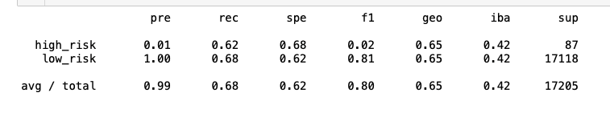
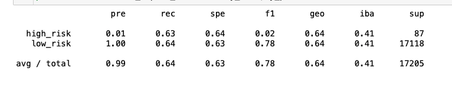
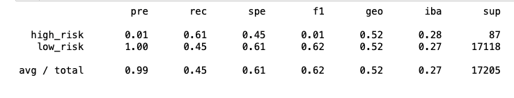
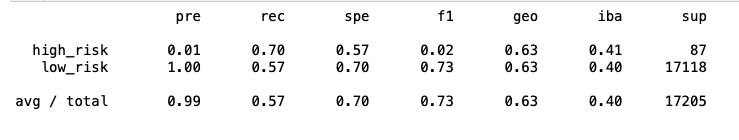
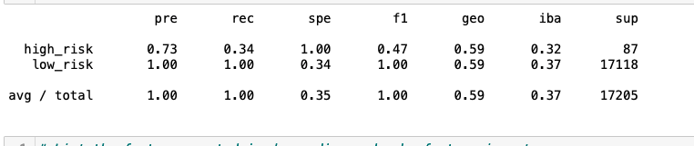
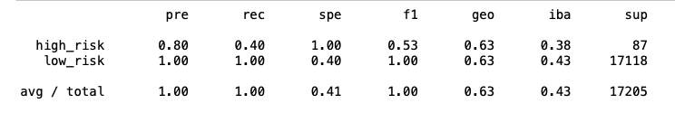

# Credit_Risk_Analysis

##Overview

### Purpose

Process the "LoanStats_2019Q1.csv" data, with the below **M**achine **L**earning **Al**gorithms to determine credit risk.

	
 
 
 
###Results:
Below is the results for Oversample, RandomOverSampler
		
		Balance Accuracy Score is 65%

Below is the results for Oversample, SMOTE

		Balance Accuracy Score is 65%

Below is the results for Undersampling, SMOTE

		Balance Accuracy Score is 64%

Below is the results for Combination_Over_and_Under_Sampling

		Balance Accuracy Score is 53%

Below is the results when we compare two diffrent ensemble classifiers

		BalancedRandomForestClassifier 67% accuracy

	
	
		EasyEnsembleClassifier	70%	
		
		

### Summary: 
 
 
 Summarize the results of the machine learning models, and include a recommendation on the model to use, if any. If you do not recommend any of the models, justify your reasoning.
 

